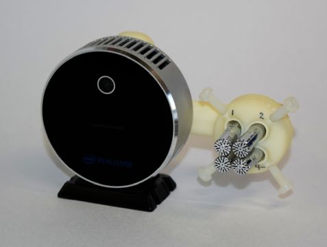

# USVCAM: acoustic camera system for ultrasonic vocalizations

 &nbsp;&nbsp;  &nbsp;&nbsp;  

**USVCAM** is an acoustic camera system for localization and assignment of ultrasonic vocalizations (USVs) for interacting laboratory rodents. Thanks to its design utilizing a small phased microphone array combined with a camera, USVCAM has many advantages over the previous systems using a distributed microphone array.

## Features
+ Single and compact sensor assembly.
+ Applicable to various experimental apparatuses, e.g., recording in home cages. 
+ Speedy processing (near real-time speed with a single inexpensive PC).
+ Precision comparable to or better than the previous systems.
+ Syllable extraction for each of the simultaneously vocalizing animals.
+ User friendly interfaces and functions.

For more information about the technology and the validation, see also our preprint below:
> [**Acoustic camera system for measuring ultrasound communication in mice**](https://www.biorxiv.org/content/10.1101/2021.12.12.468927v1)            
> Matsumoto J, Kanno K, Kato M, Nishimaru H, Setogawa T, Chinzorig C, Shibata T, Nishijo H      
> *[biorxiv 2021](https://www.biorxiv.org/content/10.1101/2021.12.12.468927v1)*

## Getting Started

See [the user guide](./docs/user_guide.md).

## Roadmap
- [x] First release
- [ ] Support for different types of cameras
- [ ] Integrating USVSEG+ as a python script
- [ ] User guide for video tracking of interacting animals
- [ ] Use of more sensitive microphone for larger recording area.
- [ ] Cheaper, pre-assembled sensor unit

## Contacts
Follow [@jumpeim_uot](https://twitter.com/jumpeim_uot) on Twitter for the news and update.

Feel free to open an issue in github for questions and feature requests.

For other issues, email to Jumpei Matsumoto or Kouta Kanno (the e-mail addresses are in the peper above).

## License
USVCAM is distributed under the MIT License. See [LICENSE](./LICENSE) for more information. 

USVCAM partly uses the codes of [USVSEG](https://github.com/rtachi-lab/usvseg). See [LICENSE_USVSEG](./usvseg_plus/LICENSE_USVSEG) for the license of the original version.

## Citation
Please cite the following paper when you publish research works using USVCAM:
> [**Acoustic camera system for measuring ultrasound communication in mice**](https://www.biorxiv.org/content/10.1101/2021.12.12.468927v1)            
> Matsumoto J, Kanno K, Kato M, Nishimaru H, Setogawa T, Chinzorig C, Shibata T, Nishijo H      
> *[biorxiv 2021](https://www.biorxiv.org/content/10.1101/2021.12.12.468927v1)*

More information about the USV segmentation algorithm used in the USVCAM is described in the paper below:
> [**USVSEG: A robust method for segmentation of ultrasonic vocalizations in rodents.**](https://journals.plos.org/plosone/article?id=10.1371/journal.pone.0228907),            
> Tachibana RO, Kanno K, Okabe S, Kobayasi KI, Okanoya K      
> *[PloS one 15(2) e0228907](https://journals.plos.org/plosone/article?id=10.1371/journal.pone.0228907)*

## Acknowledgement
This work was supported by Grant-in-Aid for Scientific Research from Japan Society for the Promotion of Science (nos. 16H06534, 21K06438, 19H04912), the Firstbank of Toyama Scholarship Foundation Research Grant, Tokyo Biochemical Research Foundation, Takeda Science Foundation, Grant for Basic Science Research Projects from The Sumitomo Foundation, and RIKEN Collaborative Technical Development in Data-driven Brain Science.

