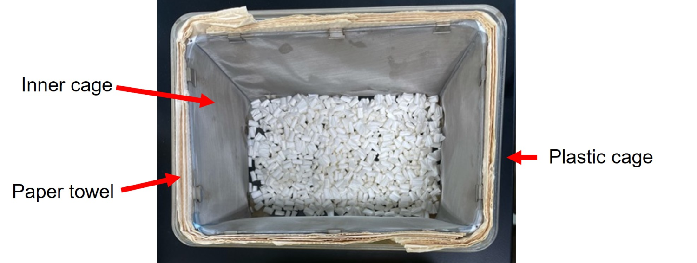
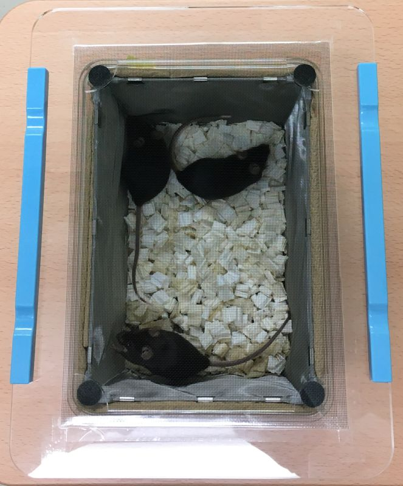

# Fine mesh inner cage

To reduce sound reflection in the home cage, an inner cage is placed inside the plastic home cage as shown in the picture below.

 

The inner cage is made of fine stainless mesh. It should be used with paper towels inserted between the plastic home cage and the inner cage, as a disposal (and sterilized) sound absorbing material. The inner cage can be sterilized with an autoclave. 

Here is a guide for making the inner cage by yourself. 

## Materials
- Fine stainless mesh (150 mesh/inch)
- &phi; 2 mm stainless rod or pipe
- 3D printed joints (x4 joints for the top ([STL file](../misc/inner_cage/ic_joint_top.stl)) and x4 joints for the bottom ([STL file](../misc/inner_cage/ic_joint_bottom.stl)); printing material = nylon; enlarge the holes with a drill using &phi;2.0-mm or 2.1-mm tip)*
- Pattern sheets ([Sheet-1](../misc/inner_cage/Sheet-1.pdf), [Sheet-2](../misc/inner_cage/Sheet-2.pdf), [Sheet-3](../misc/inner_cage/Sheet-3.pdf))*
- [Gachuck and clips (small)](https://www.ohto.co.jp/english/product/ecogachuck/)
- Solder and soldering iron
- Stainless steel flux
- Cyanoacrylate glue (select one for nylon & metal)

*\*the dimension was designed for [this plastic cage](https://www.clea-japan.com/en/products/plastic_cage/item_t0040)*

## Procedure
1. On the Sheet-1, assemble the bottom part of the frame. Glue the joints and the rods.
2. Similarly, assemble the top part. Glue the joints and the rods.
3. Glue the rods for walls to the (1).
4. Copy Sheet-2 and Sheet-3 on stainless mesh and cut.
5. Solder and connect the edges of (4) with flux. Clean out flux with ethanol.
6. Hold the top and bottom part of the mesh as in the picture.
7. Assemble the top part of the frame (2) with the rest (3). Do not glue them at this stage.
8. Fix the mesh (6) on the frame (7) using Gachuck clips. Then, pull up the frame top and glue it with the rest part of the frame, to make the mesh surface as flat as possible. 
9. Fix the clips on the mesh with solder using flux. Clean out flux with ethanol. 
10. Finally, gently wash the inner cage with neutral detergent and water. 

 

---
## Cage lid for video and sound recording
The photo below is an example of cage lid used with the inner cage during recording. [A clear window screen](https://www.ykkap.co.jp/search-b/search/windoor/gaiyou/clearnet.php) is pasted on a acrylic frame. Rubber feet are attached at the corners of the lid to pin down the inner cage. Blue bars are weights. 

 

