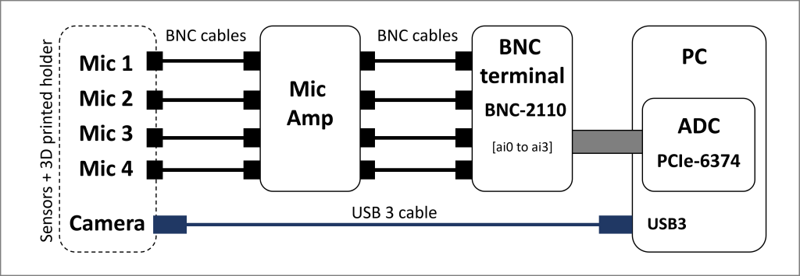
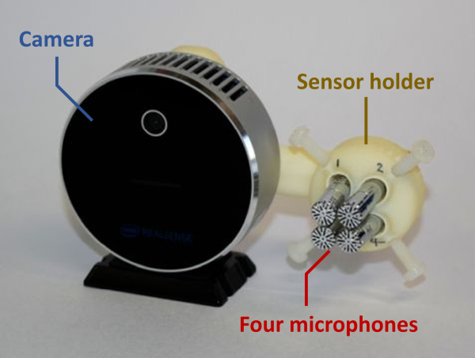
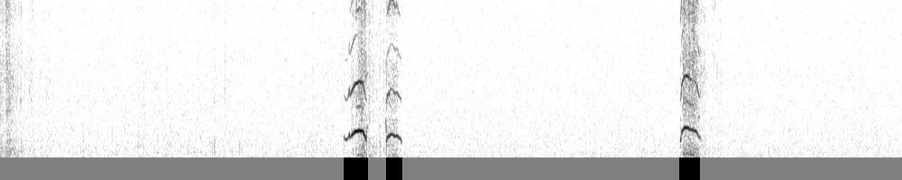

# User guide 

*Feel free to open an issue in github for questions.*

## Index
1. [Preparing hardware](#prep_hard)
2. [Installing software](#installing)
3. [Recording](#recording)
4. [Analysis](#analysis)
5. [Information for advanced users](#info_au)

To play with pre-recorded test data, check (2) and (4). 

---
<a name="prep_hard"></a>
## 1. Preparing hardware

For recording, the system requires the following PC, AD converter, and sensors. The connections between these devices are shown below.

 

You may also need some customized equipments to minimize sound reflections for precise sound localization (see below).

For analysis, you can use the same or a PC with similar performance. The operating system of the recording PC is Windows, but Mac and Linux OS can also be used for analysis (Contact us for this).

### PC
- CPU: Core i7 or Faster
- RAM: 16 GB or larger
- One empty x4/x8/x16 PCI Express slot
- SSDs are recommended for the OS and the initial data storage.
- (Optional) NVIDIA CUDA GPU (e.g., GeForce RTX 2060; use of the GPU makes sound localization around x2 faster)

### AD converter
- National instruments [PCIe-6374](https://www.ni.com/ja-jp/support/model.pcie-6374.html)
- National instruments [BNC-2110](https://www.ni.com/ja-jp/support/model.bnc-2110.html) (BNC terminal of the board)

### Microphone amplifier
- A custom four-channel microphone amplifier (BSA-CCPMA4-UT20) made by Katou Acoustics Consultant Office. Contact [authors](https://) about how to purchase the same device from the company. 
- OR you may be able to use another microphone amplifier which fits the microphones and the AD converter, and has no noise from 1 to 100 kHz. 

### Sensor assembly
- Microphones: 4 x [Aco TYPE 4158N](https://www.aco-japan.co.jp/english/product/id538.html)
- Camera: [Intel Realsense L515](https://www.intelrealsense.com/lidar-camera-l515/)
- 3D printed sensor holder ([STL file](../misc/sensor_holder.stl)).
- M3 stainless steel screws and M4 nylon screws

The picture below shows the assembled sensors. 

 

**Details**: The microphones are fixed with the M4 screws and the camera is fixed with M3 screws to the 3D printed holder. The holder should be printed with ABS, nylon or equivalents. After printing, cut the thread for the M4 screws. You may also need to slightly enlarge the holes for microphones with a &phi;7-mm drill tip. Insert the microphone from its back to avoid plastic dust covering the microphone. Make the distance between microphones minimum, but without touching. You can use the [camera mounting screw hole on the bottom of the camera](https://www.intelrealsense.com/wp-content/uploads/2019/12/lidar_camera_gallery_3.jpg) to fix the sensor assembly to your own experimental setup. 

**TIPS**: In the long (>1 m) connection, use of a high quality industrial USB 3 cable (such as [this](https://www.newnex.com/usb-3-products.php)) is recommended for stable video capturing.

### Equipment to minimize sound reflections
- The recording room where ultrasound reflections are minimized. For example, we used a soundproof box with 20-mm thickness melamine foam on its walls and ceiling. 
- The behavioral testing chamber where ultrasound reflections are minimized. For example, we used a [fine mesh inner cage](./inner_cage.md) for recording in home cages.

---
<a name="installing"></a>
## 2. Installing software

Install the camera driver ([Intel RealSense SDK 2.0](https://github.com/IntelRealSense/librealsense/releases)), the AD converter driver ([NI-DAQmx](https://www.ni.com/en-us/support/downloads/drivers/download.ni-daqmx.html)) and [Anaconda](https://docs.anaconda.com/anaconda/install/).
Optionally, to use a CUDA GPU, install the recent [NVIDIA driver](https://www.nvidia.com/Download/index.aspx).

Then, download the [USVCAM software](release) and extract it somewhere in the PC. Below the path of the extracted directory is assumed to be `C:/usvcam/`. 

Open **Anaconda Prompt** from the start menu. And move to the extracted directory with the following command:

```
(base) C:\> cd C:\usvcam
```

Setup a conda enviroment for USVCAM with the following commands, for the non-GPU version:
```
(base) C:\usvcam> conda env create -n usvcam -f conda_env/usvcam.yaml
```

For GPU version:
```
(base) C:\usvcam> conda env create -n usvcam -f conda_env/usvcam_gpu.yaml
```

And activate the conda environment with the following command:
```
(base) C:\usvcam> conda activate usvcam
```

Finally, install USVCAM software package to the environment with the following command:
```
(usvcam) C:\usvcam> pip install . 
```

Optionally, enable GPU usage by editing the configuration file. You can open the config file with the following command:
```
(usvcam) C:\usvcam> config
```
Replace `use_gpu: false` with `use_gpu: true` in the config file and save the change.

---
<a name="recording"></a>
## 3. Recording

Open **Anaconda Prompt** from the start menu. Change the current directory to a directory (let's say: `C:/experiment1`) where you want to save the data with the following command:
```
(base) C:\> cd C:/experiment1
```

Activate the conda environment with the following command:
```
(base) C:\experiment1> conda activate usvcam
```

Before the initial recording, edit the configuration file to input the recording parameters. You can open the config file with the following command:
```
(usvcam) C:\experiment1> config
```

`camera_height` should be changed to the actual height of the camera from the floor in your recording setup. Change `color_mode` to 0 or 1, if you want to acquire infrared or color video, respectively. `laser_power` indicates the power of IR-emitter of the camera (range = 0 to 100). `daq_dev_name` may need to be changed to the actual name of the installed AD converter (you can check it by opening **NI MAX** from the start menu). 

Lunch the recorder app with the following command:
```
(base) C:\experiment1> rec file_prefix
```
Replace `file_prefix` with any text that you want as the prefix of the recorded file name. 

In the recorder app, you can monitor the camera image and the sound spectrogram online. Press **s** key in the keyboard to start the recording. Press **ESC** key to stop the recording and close the app. 

After the recording, a data directory is generated in the current working directory. The directory contains 4 files: `vid.mp4`, the video; `snd.dat`, the sound; `sync.csv`, the video-sound synchronization; `param.h5`, other metadata.

---
<a name="analysis"></a>
## 4. Analysis

You can download test data from [here](https://1drv.ms/u/s!AlpK-j-ONYp37SV3Nf3b7ooyW8eb?e=txUYkZ) (1.7 GB), to try the analysis below without your own recording. The following python commands are summarized in a [jupyter-notebook](../example.ipynb).

**NOTE**: In addition to data generated with the recorder app, you need `snout.csv` file in the data directory, which contains xy locations (in pixels) of the snout of each mouse in all the video frames in `vid.mp4`. In `snout.csv` file, each row represents a video frame, and the format of the row is `x of mouse1, y of mouse1, x of mouse2, y of mouse2, ...`. Prepare the data by processing `vid.mp4` with a video tracking software (such as [DeepLabCut](https://github.com/DeepLabCut/DeepLabCut), [SLEAP](https://github.com/murthylab/sleap), etc). In the test data, `snout.csv` files made by authors are included.

### 4.1 Preprocess - USV segmentation

Before the analyses described in following sections, the data needs to be preprocessed to search for USV segments. 

Open **Anacomda Prompt** from the start menu and run `ipython` or `jupyter-notebook`.

Run the following python codes, given that the data directory is `./test_data/single_mouse`:
```
import usvcam.analysis

data_dir = './test_data/single_mouse'

usvcam.analysis.dat2wav(data_dir, 3)
```
This will convert the `snd.dat` file to a wav file.

Then, perform USV segmentation using the wav file with USVSEG+ module (read [here](../usvseg_plus/README.md) for detail).

### 4.2 Calibrating microphone positions

For the sound localization, the system needs the accurate information of the position of microphones relative to the camera origin. USVCAM has a function to help this calibration process. For the calibration, you need a pre-recorded data in which only one mouse vocalized (*single mouse data*). Recommended number of vocalization (syllables) in the data is >100. You only need this calibration once, as long as the relative positions of microphones to the camera are same. Calibration once in a week would be recommended.

**TIPS**: To obtain the single mouse data, you can put a male mouse and bedding from a female cage, or a male mouse and an anesthetized female. 

After the USV segmentation (4.1), run the following python code:
```
usvcam.analysis.calib_with_voc(data_dir, outpath='./test_data/micpos.h5')
```
The program will automatically categorize syllables into 20 groups based on the locations where they were emitted. Then, the program asks you to select one clean USV recording (minimum noise and high S/N) from each group. Press space key to pick or other keys to skip the displayed USV. Finally the program start an optimization process to estimate microphone positions using the selected USVs and their locations. The result of calibration is saved in the file path specified as the `outpath` variable.

### 4.3 Estimating parameters for assignment

*This process takes hours. If you are using the test data and want to skip the process, download the result from [here](https://1drv.ms/u/s!AlpK-j-ONYp37SS_s967ZveXYM2D?e=h5GUqC).*

Performance of the sound localization depends on various factors, especially acoustic environment of the recording setup. Thus, USVCAM needs data for performance validation in each environment and adjusts criteria for assignment according to the validation. For the validation data, you need single mouse data. Recommended total number of vocalization (syllables) in the validation data is >1,000. They can be recorded in multiple sessions. 

After the USV segmentation (4.1), run the following python codes, given that the data directory is `./test_data/single_mouse`:
```
import usvcam.analysis

data_dir = './test_data/single_mouse'
calibfile = './test_data/micpos.h5'
assignfile = './test_data/assign_param.h5'

usvcam.analysis.estimate_assign_param([data_dir], [calibfile], assignfile, show_figs=True)
```

Or if you have multiple single mouse recording data (let's say, `single_mouse_1-3`) for validation, run:
```
import usvcam.analysis

data_dirs = ['./test_data/single_mouse_1', 
             './test_data/single_mouse_2',
             './test_data/single_mouse_3']
calibfiles = ['./test_data/micpos.h5',
              './test_data/micpos.h5',
              './test_data/micpos.h5',]
assignfile = './test_data/assign_param.h5'

usvcam.analysis.estimate_assign_param(data_dirs, calibfiles, assignfile, show_figs=True)
```
Note that different calibration file for each data directory can be used, if necessary.  

The estimated criteria for assignment (see our paper for detail) are saved in the file path specified as the `assignfile` variable.

### 4.4 USV localization and assignment

Now you can localize and assign USVs recorded during social interactions using the parameters estimated above (4.2 and 4.3). 

After the USV segmentation (4.1), run the following python codes, given that the data directory is `./test_data/two_mice` and there were two mice in the recording:
```
import usvcam.analysis

data_dir = './test_data/two_mice'
calibfile = './test_data/micpos.h5'
assignfile = './test_data/assign_param.h5'
n_mice = 2

usvcam.analysis.assign_vocalizations(data_dir, calibfile, assignfile, n_mice)
```
The result of the assignment is saved in `result.csv` in the data directory. In the file, each row indicates a syllable. First column indicates the syllable IDs. Second column indicates the mouse ID (starting from zero. ID=-1 means the syllable was unassigned). Third column indicates the assign rate; the rate = 1.0, when the segmenents in the syllable are perfectly assigned to a single mouse. The other columns are the acoustic parameters: start, syllable onset (sec); end, syllable offset (sec); duration, syllable duration (msec); maxfreq, maximum frequency (kHz), maxamp, maximum amplitude (a.u.); meanfreq, mean frequency (kHz); cvfreq, frequency variations (SD/mean; kHz).

Optionally to visualize the USV localization, run:
```
usvcam.analysis.create_localization_video(data_dir, calibfile, color_eq=True)
```

and to visualize the USV assignment, run:
```
usvcam.analysis.create_assignment_video(data_dir, n_mice, color_eq=True)
```

These processes result in video files (`vid.loc.mp4` and `vid.asgn.mp4`) in the data directory. 


---
<a name="info_au"></a>
## 5. Information for advanced users

### 5.1 Analysis on the shapes of assigned syllable
The peak trace of each of the syllables are saved in `seg2` directory inside the data directory. The directory contains csv files. The numbers in the csv file names correspond to the syllable IDs (the first column) in `result.csv`. The sound peak locations and their amplitude in the spectrogram can be found in the three columns named `time`, `frequency`, and `amplitude` in each of the csv files.

### 5.2 detecting audible BBVs and excluding the period from the analysis
Mice occassionally emit audible broadband vocalization (BBV; 'squeak'). To prevent misidentifying BBVs as USVs and misassigning USVs overlapping with BBVs, USVCAM has a function to detect and exclude BBVs. To detect BBVs, after USV segmentation, run the following code:
```
import usvcam.tool 

data_dir = './test_data/two_mice'

usvcam.tool.detect_bbv(data_dir, thr=1.4)
```
The results of the detection will be saved in `bbv_detection` directory in the data directory. Each image file in the directory shows a spectrogram (frequency range: 2-16 kHz) of a 5-sec time window and BBV detections as black bars below the spectrogram. An example of the image file is shown below:

 

If you want to change the sensitivity of the detector, change the `thr` variable slightly and run the code again. The function generates `mask.csv` in the data directory as a result. The file contains time intervals of detected BBVs and will be used in the following USV assignment processes.

