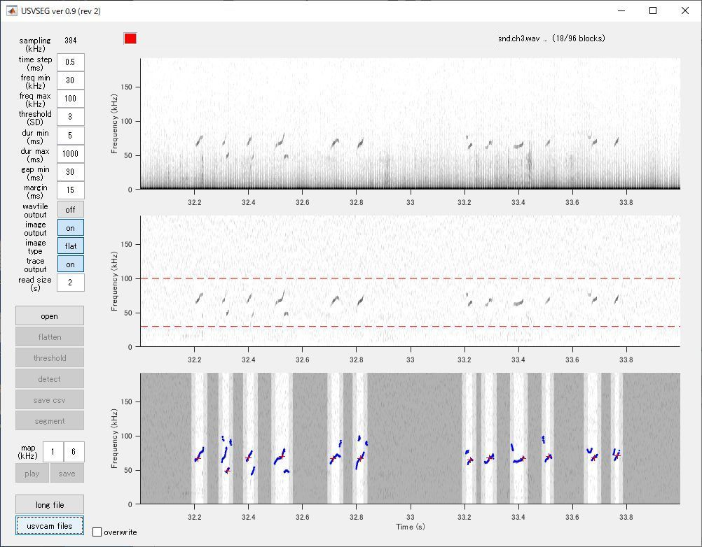

# USVSEG+: USV segmentation module for USVCAM

USVSEG+ is a USV segmentation module of USVCAM based on [USVSEG](https://github.com/rtachi-lab/usvseg) developed by [Dr. Ryosuke Tachibana](https://sites.google.com/view/rtachi/home):

> [**USVSEG: A robust method for segmentation of ultrasonic vocalizations in rodents.**](https://journals.plos.org/plosone/article?id=10.1371/journal.pone.0228907),            
> Tachibana RO, Kanno K, Okabe S, Kobayasi KI, Okanoya K      
> *[PloS one 15(2) e0228907](https://journals.plos.org/plosone/article?id=10.1371/journal.pone.0228907)*

## How to use

Start the program:
- If you have Matlab in your computer, run *usvseg09r2_plus.m*.
- If you don't have Matlab, install [Matlab Runtime R2021a](https://www.mathworks.com/products/compiler/mcr/index.html) and run *usvseg09r2_plus.exe*.

The screenshot below shows the USVSEG+ app window.

To process the data recorded with USVCAM (after generating wav files), click `usvcam files` button in the window and select a data directory or a parent directory including multiple data directories. For detail of the other parts of the program, see the [original documentation](https://sites.google.com/view/rtachi/resources#h.p_AxBh2B9_Zjo2) of USVSEG. The `dur max` parameter should be longer than 1,000 msec to segment overlapping USVs.

## License
See [LICENSE_USVSEG](./usvseg_plus/LICENSE_USVSEG) for the license of the original version of USVSEG.